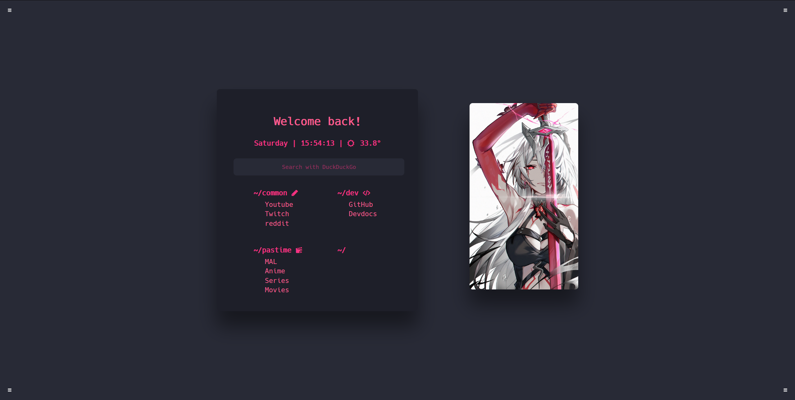

# Startpage

This is my personalized startpage, designed to be my browser homepage. It includes quick links to my favorite websites, a search bar, and a minimalist layout.

## Screenshots

## Usage

    1. Clone this repository: git clone https://github.com/EdgeLordKirito/Startpage.git
    2. Open index.html in your browser.
    3. Customize the links and style according to your preferences.

## Customization

Personalize the Links in the index-html file  
Personalize the Colours in the static\styles\styles.css file
## Credits
- Inspired from [Druxorey Startpage](https://github.com/druxorey/startpage).